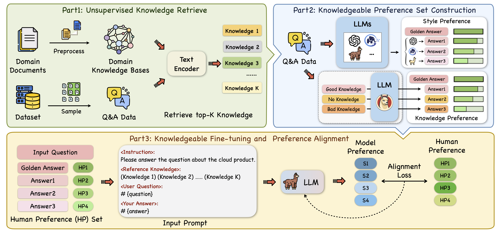

# Knowledgeable Preference Alignment for LLMs in Domain-specific Question Answering

[](https://github.com/zjukg/KnowPAT/main/LICENSE)
[](https://arxiv.org/abs/2311.06503)
[](https://pytorch.org/)
 - [Knowledgeable Preference Alignment for LLMs in Domain-specific Question Answering](https://arxiv.org/abs/2311.06503)

> For domain-specific application of large language models (LLMs), external knowledge and LLMs should work together to achieve best user experience. LLMs should acquire an ability to **make the right choices** about retrieved external knowledge to meet the human needs. Knowledgeable Preference AlignmenT (KnowPAT) is a new pipeline to align LLMs with human's knowledge preference. KnowPAT incorporates domain knowledge graphs to construct preference set and design new alignment objective to fine-tune the LLMs.

## 🌈 Model Architecture


## 💻 Data preparation
For reasons of **commercial confidentiality**, the dataset in our paper will **not** be made public. However, we provide examples of the data in `data/` so that you can construct your own preference dataset and try out our alignment method according to the given format.

For each data instance, you should prepare a question and several answers, and the human preference score of each answer. A higher score means a better and preferred answer. Note that the answers should be sorted in the **score descending** order, which means the better answer and its score should be in the front.

- **News**: We now add a new Chinese QA datasets [RJUA](https://github.com/alipay/RJU_Ant_QA) and it is open-sourced. You can try to conduct experiments on this dataset.


## 🔬 Dependencies
Our code is developed based on [RRHF](https://github.com/GanjinZero/RRHF). Please build the Python environment following the instruction like RRHF.

To set up, you can use the following command lines to set up python3.8 and pytorch requirements:

```shell
conda create -n alignment python=3.8
pip install torch==1.13.0+cu116 torchvision==0.14.0+cu116 torchaudio==0.13.0 --extra-index-url https://download.pytorch.org/whl/cu116

```
Install other packages:

```shell
pip install -r requirements.txt
```

## 📕 Training & Test

- run KnowPAT training on RJUA datasets

```shell

export MODEL_PATH="YOUR LLM PATH"
export SAVE_PATH="YOUR SAVE PATH"
export DATA_PATH="data/RJUA_train.json"
export WANDB_DISABLED=true
wandb offline

CUDA_VISIBLE_DEVICES=1 nohup python train.py \
    --model_name_or_path $MODEL_PATH \
    --data_path $DATA_PATH \
    --bf16 True \
    --output_dir $SAVE_PATH \
    --num_train_epochs 3 \
    --per_device_train_batch_size 1 \
    --per_device_eval_batch_size 1 \
    --gradient_accumulation_steps 8 \
    --evaluation_strategy "no" \
    --save_strategy "steps" \
    --save_steps 300 \
    --save_total_limit 40 \
    --learning_rate 1e-4 \
    --weight_decay 0. \
    --warmup_ratio 0.03 \
    --lr_scheduler_type "cosine" \
    --logging_steps 1 \
    --model_max_length 512 --rrhf_weight 0.01 > log_rjua.txt &

```
You may need to fill your model/save/data path before running. The model path should be a llama-architecture LLM.

- run inference
```shell
CUDA_VISIBLE_DEVICES=0 python inference.py
```


## 🤝 Cite:
Please consider citing this paper if you use the code from our work.
Thanks a lot :)

```bigquery

@article{DBLP:journals/corr/abs-2311-06503,
  author       = {Yichi Zhang and
                  Zhuo Chen and
                  Yin Fang and
                  Lei Cheng and
                  Yanxi Lu and
                  Fangming Li and
                  Wen Zhang and
                  Huajun Chen},
  title        = {Knowledgeable Preference Alignment for LLMs in Domain-specific Question
                  Answering},
  journal      = {CoRR},
  volume       = {abs/2311.06503},
  year         = {2023}
}

```
